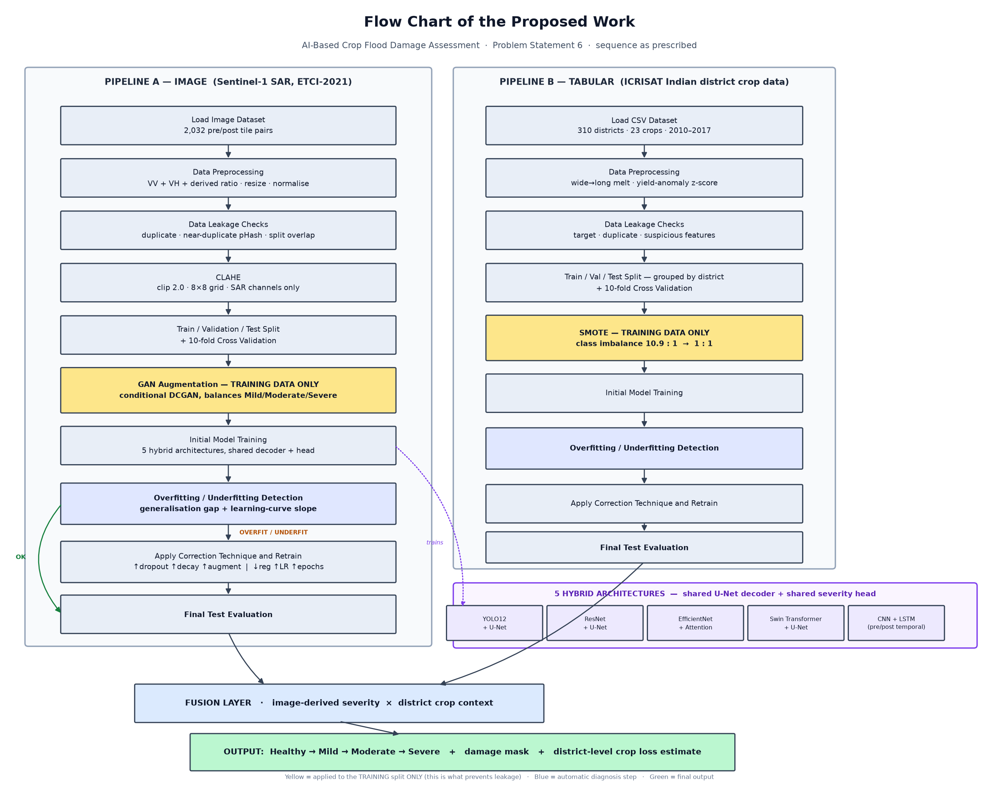
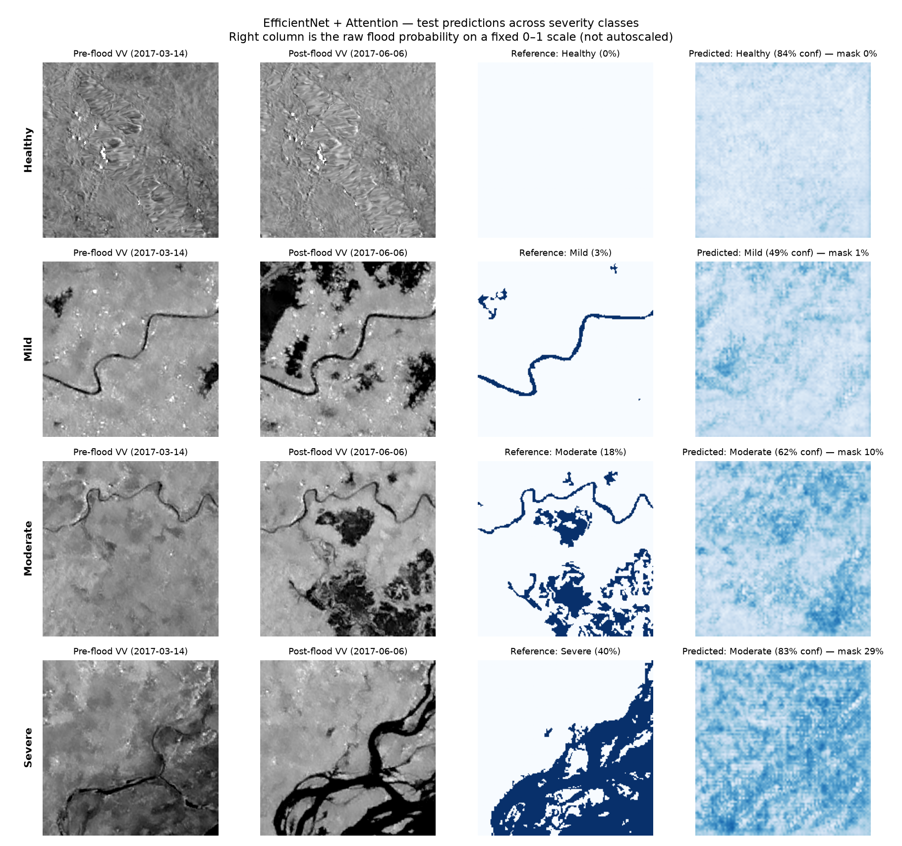
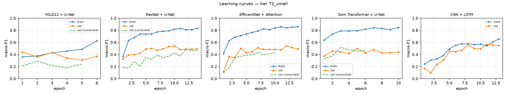
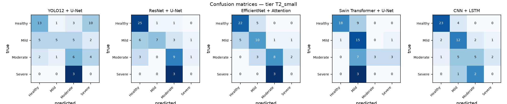
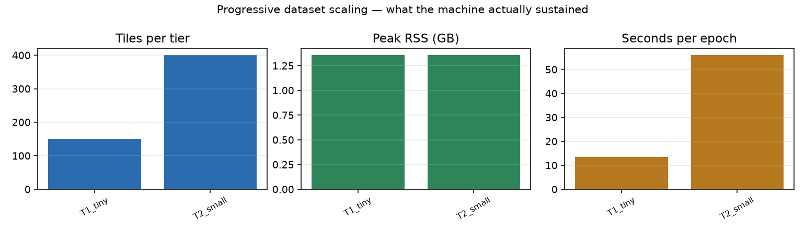

# AI-Based Crop Flood Damage Assessment

[](https://github.com/tejgokani/flood-crop-damage-ai/actions/workflows/ci.yml)


> **VIT Tech-a-thon, Fall Semester 2026–27 — Problem Statement 6** · Agriculture + Disaster Management

Floods destroy crops across large regions, and field surveys are impossible in the days that
matter most — the roads are under water. This system estimates crop damage from
**cloud-penetrating Sentinel-1 SAR satellite imagery** and reports it as
**Healthy → Mild → Moderate → Severe**, then converts that into hectares, tonnes and rupees
using real Indian district crop statistics.

**Five hybrid architectures are benchmarked under one identical protocol**, so a difference in
the results table is attributable to the architecture rather than to the training recipe.

---

## The flow chart of the proposed work



Both prescribed sequences are implemented in full and execute in the given order.
Every step maps to a named function — see **[`docs/sequence_compliance.md`](docs/sequence_compliance.md)**.

---

## Why this design — traced to six papers' own future work

The objective is not invented. It is derived from what six recent papers say is missing in
their own concluding sections, quoted verbatim in
**[`docs/literature_review.md`](docs/literature_review.md)**.

| Gap the literature names | Stated by | What we built |
|---|---|---|
| **G1** Labelled data scarcity | FLNet · Physics-guided U-Net+FNO · TDAVM-UNet · Climate-informed CNN | GAN augmentation on the training split only, plus hardware-gated progressive data tiering |
| **G2** Single-date imagery confuses flood with permanent water | Swin flood-scene · Physics-guided · Explainable SAR | **CNN + LSTM** over real pre/post-monsoon pairs, and permanent-water masks subtracted before labelling |
| **G3** No unified multi-architecture comparison | FLNet · Explainable SAR | **Five hybrids on one shared split, loss and metric set** |
| **G4** No fusion with regional agricultural context | FLNet · TDAVM-UNet · Climate-informed | Fusion with **ICRISAT district crop statistics** — a real crop pattern, not a constant mask |
| **G5** Cloud cover defeats optical imagery | FLNet · Swin flood-scene | **Sentinel-1 SAR (VV/VH)**, which sees through cloud |
| **G6** Compute cost blocks deployment | Physics-guided · TDAVM-UNet | Wall-clock-capped training that completes on a 16 GB laptop |

Two quotes that shaped the architecture directly:

> "we also plan to investigate architectural improvements, such as directly fusing Sentinel-1
> and Sentinel-2 data and experimenting with state-of-the-art backbones like Transformers"
> — *FLNet*, arXiv:2601.03884

> "incorporating multi-temporal SAR data, in which pre-flood and post-flood images are jointly
> analyzed, could help models better distinguish temporary flooding from permanent water bodies."
> — *Explainable Flood Segmentation on Sentinel-1 SAR*, arXiv:2606.16302

Full objective and sub-objectives: **[`docs/objective.md`](docs/objective.md)**.

---

## Results

<!-- RESULTS:START -->
Deepest tier completed: **T2_small** (400 tiles at 192px, device `mps`). Tiers walked: T1_tiny → T2_small.

Scaling stopped because: _advancing to T3_medium: projected 29 min, 1.4 GB peak, 27.9 GB disk free_

### Image pipeline — five hybrids, one protocol

| Hybrid architecture | Params | Test macro-F1 | Accuracy | Cohen's κ | Flood IoU | Dice | Diagnosis | Correction helped |
|---|---:|---:|---:|---:|---:|---:|---|:--:|
| EfficientNet + Attention | 5.7M | **0.507** | 0.667 | 0.500 | 0.206 | 0.342 | OVERFIT | no |
| ResNet + U-Net | 24.4M | **0.500** | 0.683 | 0.511 | 0.222 | 0.364 | OVERFIT | no |
| CNN + LSTM | 9.0M | **0.484** | 0.667 | 0.500 | 0.195 | 0.327 | OK | — |
| Swin Transformer + U-Net | 31.9M | **0.436** | 0.600 | 0.414 | 0.241 | 0.388 | OVERFIT | yes |
| YOLO12 + U-Net | 9.8M | **0.342** | 0.400 | 0.192 | 0.158 | 0.273 | OVERFIT | no |

**Per-class F1 (test)**

| Hybrid | Healthy | Mild | Moderate | Severe |
|---|---:|---:|---:|---:|
| YOLO12 + U-Net | 0.553 | 0.417 | 0.400 | 0.000 |
| ResNet + U-Net | 0.820 | 0.560 | 0.621 | 0.000 |
| EfficientNet + Attention | 0.815 | 0.571 | 0.640 | 0.000 |
| Swin Transformer + U-Net | 0.783 | 0.588 | 0.375 | 0.000 |
| CNN + LSTM | 0.868 | 0.615 | 0.455 | 0.000 |

Tier class distribution: `{'Healthy': 180, 'Mild': 117, 'Moderate': 83, 'Severe': 20}` (tiers cap Healthy at 45%; the natural prior in the full pool is 86.9% Healthy / 0.98% Severe).

**GAN augmentation** (training split only): 224 synthetic tiles from 280 real ones over 40 epochs in 105s.

**Leakage audit (image)**: findings present — 6 finding(s).

### Tabular pipeline — Indian district crop statistics

| Metric | Value |
|---|---:|
| Test macro-F1 | **0.355** |
| Test accuracy | 0.539 |
| Cohen's κ | 0.156 |
| 10-fold CV macro-F1 | 0.404 ± 0.010 |
| SMOTE | {'0': 14260, '1': 4329, '2': 4186, '3': 1266} → balanced (+32999 rows) |
| Target leakage caught | `yield, production, yield_z, yield_mean, yield_std, label_name` |

**Predictions across severity classes**



**Learning curves**



**Confusion matrices**



**Progressive scaling**


<!-- RESULTS:END -->

---

## The five hybrid architectures

All five end in the **same U-Net decoder and the same dual head**, so the benchmark isolates
the encoder.

| # | Hybrid | Encoder | Why it is here |
|---|---|---|---|
| 1 | **YOLO12 + U-Net** | R-ELAN stages + band-wise area attention, implemented natively | Detection localises field parcels while segmentation delineates water inside them. No `ultralytics` dependency — the AGPL package is heavy for something used only as an encoder |
| 2 | **ResNet + U-Net** | `timm` resnet34 | The established baseline the comparison is measured against |
| 3 | **EfficientNet + Attention** | `timm` efficientnet_b0 + CBAM + attention-gated skips | Best accuracy per FLOP; the attention shape TDAVM-UNet validates for agricultural UAV imagery |
| 4 | **Swin Transformer + U-Net** | `timm` swinv2_tiny | Shifted-window attention gives a global receptive field at linear cost — the long-range dependency the Swin flood paper argues is needed for boundary precision |
| 5 | **CNN + LSTM** | Shared CNN + **ConvLSTM at every scale** | Consumes the real pre-monsoon/monsoon pair. A ConvLSTM keeps the recurrent state spatial, which a vector LSTM would discard |

### The shared head does something slightly unusual
The severity classifier reads average-pooled features, **max-pooled** features, *and*
`mean(sigmoid(segmentation))` — the predicted net flood fraction. Since the severity label is
*defined* as the net inundated fraction, this hands the classifier the exact quantity the
target is built from instead of asking it to rediscover an area computation. Max pooling is
there because most of a damaged tile is still dry field, and average pooling alone washes out
the small intense flooded region that separates Mild from Severe.

---

## Data

| | Source | Detail |
|---|---|---|
| **Imagery** | [ETCI-2021 Flood Detection](https://huggingface.co/datasets/blanchon/ETCI-2021-Flood-Detection) | Sentinel-1 SAR over Bangladesh. **2,032 tiles with a genuine pre/post pair**: 2017-03-14 (pre-monsoon) and 2017-06-06 (monsoon flood), each with VV, VH, flood mask and permanent-water mask |
| **Agriculture** | [ICRISAT district crop statistics](https://github.com/nileshely/Crop-Datasets-for-All-Indian-States) | 310 Indian districts · 23 crops · 2010–2017 · area, production, yield |
| **Offline** | `src/fcda/data/synthetic.py` | Deterministic procedural generator so the pipeline runs with no network at all |

Both sources are public and need no credentials. Nothing is bulk-downloaded — tiles are fetched
per tier, on demand.

### How severity is defined
Per tile, the **net** inundated fraction (flood mask **minus permanent water**), binned at
**2% / 10% / 33%**. The top boundary is not a round number chosen for convenience: Indian
NDRF/SDRF relief practice treats a crop loss of **33% or more** as the point at which a holding
qualifies for input-subsidy compensation, so a "Severe" prediction lines up with a decision
somebody actually has to make.

Permanent water is subtracted because **a tile containing a river is not a damaged tile** — the
reviewed literature measures flood IoU at roughly half the IoU of permanent water precisely
because the two get confused.

---

## Progressive data scaling

The dataset is a dial, not a commitment. Training starts deliberately tiny and steps up **only
after the machine has demonstrably handled the previous rung**.

| Tier | Tiles | Size | Purpose |
|---|---:|---:|---|
| `T0_smoke` | 40 | 128 px | Pipeline proof. Offline, runs in CI |
| `T1_tiny` | 150 | 128 px | First real data |
| `T2_small` | 400 | 192 px | First meaningful signal |
| `T3_medium` | 900 | 256 px | Target tier |
| `T4_large` | 1800 | 256 px | Only if T3 finished comfortably |

After each tier, `src/fcda/data/capacity.py` records peak RSS, free disk and seconds per epoch,
and advances only if the next tier's projection stays under a 6 GB disk floor, 70% of RAM, and
the time budget. Otherwise it **stops at the last good tier and records why** in
`reports/scaling_log.json`. Stopping early is a successful outcome — the results table from the
last completed tier is complete.

A consequence worth noting: a full five-model table exists after the *first* tier, so there is
something presentable at every moment after the first hour rather than only at the end.

---

## Quick start

```bash
make setup     # Python 3.12 venv via uv, PyTorch with MPS
make smoke     # whole pipeline offline in under 2 minutes, no network
make test      # 37 tests incl. leakage and augmentation-isolation assertions
```

```bash
make data      # fetch the smallest real tier
make train     # progressive tiered training of all five hybrids
make tabular   # the CSV/SMOTE sequence on Indian crop statistics
make report    # regenerate figures and the comparison table
make demo      # Streamlit app
```

---

## Repository layout

```
src/fcda/
  data/        tiers.py capacity.py etci.py severity.py india_agri.py synthetic.py download.py
  preprocess/  clahe.py transforms.py leakage.py
  augment/     gan.py smote.py          # training split only — enforced structurally
  models/      blocks.py heads.py + the five hybrids + registry.py
  train/       loop.py diagnostics.py correction.py
  eval/        metrics.py report.py
  splits.py  fusion.py  pipeline.py  cli.py
docs/          literature_review.md  objective.md  sequence_compliance.md  flowchart.png
app/           streamlit_app.py
notebooks/     01_pipeline_walkthrough.ipynb
tests/         test_no_leakage.py  test_models.py  test_severity.py
```

---

## Honest limitations

These are stated because they are the questions worth asking, not because they were caught.

1. **Severity is derived from flood extent, not measured crop damage.** ETCI-2021 has flood
   masks, not agronomic ground truth. Validating against field-surveyed crop loss — as FLNet
   does with BFCD-22 for Bihar — is the single most valuable next step and is **not claimed here**.
2. **Only 20 Severe tiles exist in the entire pool** (0.98% natural prior). Severe-class F1 is
   computed over a handful of test tiles and is correspondingly noisy. This is the corpus's
   ceiling, and it is precisely what the GAN augmentation exists to push against.
3. **Tiers are class-rebalanced.** The natural prior is 86.9% Healthy, which left a 150-tile
   tier with two Severe tiles. Tiers cap Healthy at 45%; the natural prior is reported
   alongside every result rather than hidden.
4. **Geography.** Training data is the Ganges–Brahmaputra delta in Bangladesh — a reasonable
   analogue for the eastern Indian agricultural belt, but cross-region generalisation to other
   Indian states is untested. FLNet states the same limitation about itself.
5. **Loss coefficients are planning assumptions.** The rupee figures use assumed per-severity
   loss fractions and indicative prices, surfaced as parameters, not fitted values.

---

## What remains

- Validation against field-surveyed crop loss (BFCD-22 or state revenue records)
- Cross-region transfer to Indian districts
- Sentinel-1 + Sentinel-2 fusion, as FLNet's future work proposes
- Calibration and uncertainty estimates, as the Explainable SAR paper proposes
- 10-fold CV extended to the image pipeline once compute allows

---

## References

Six papers with their future work quoted verbatim: [`docs/literature_review.md`](docs/literature_review.md).
BibTeX: [`docs/references.bib`](docs/references.bib).

## License

MIT
