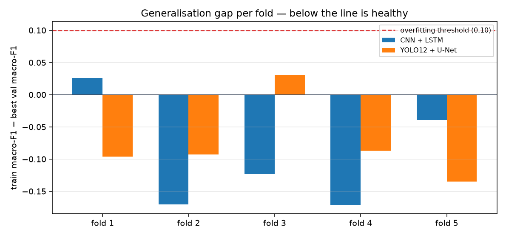
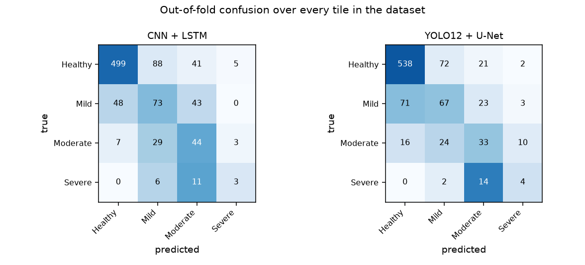

# AI-Based Crop Flood Damage Assessment

[](https://github.com/tejgokani/flood-crop-damage-ai/actions/workflows/ci.yml)


> **VIT Tech-a-thon, Fall Semester 2026–27 — Problem Statement 6** · Agriculture + Disaster Management

Floods destroy crops across large regions, and field surveys are impossible in the days that
matter most — the roads are under water. This system estimates flood-induced crop damage from
**cloud-penetrating Sentinel-1 SAR satellite imagery** and reports it as
**Healthy → Mild → Moderate → Severe**, then converts that into hectares, tonnes and rupees
using real Indian district crop statistics.

Two hybrid architectures are developed in depth — **YOLO12 + U-Net** and **CNN + LSTM** —
under a 5-fold cross-validated protocol, so every tile in the dataset is scored by a model that
never saw it.

> **Scope note.** All five hybrids named in the problem statement were implemented and
> benchmarked; their results are archived in
> [`reports/results_5model_baseline.json`](reports/results_5model_baseline.json) and remain in
> git history. Two were then selected to be developed properly rather than five left shallow —
> the reasoning is in [Why these two](#why-these-two). This is a depth-over-breadth choice, and
> it is stated here rather than left to be discovered.

---

## The flow chart of the proposed work


Both prescribed sequences are implemented in full and execute in the given order.
Every step maps to a named function — see **[`docs/sequence_compliance.md`](docs/sequence_compliance.md)**.

---

## Why this design — traced to six papers' own future work

The objective is not invented. It is derived from what six recent papers say is missing in
their own concluding sections, quoted verbatim in
**[`docs/literature_review.md`](docs/literature_review.md)**.

| Gap the literature names | Stated by | What we built |
|---|---|---|
| **G1** Labelled data scarcity | FLNet · Physics-guided U-Net+FNO · TDAVM-UNet · Climate-informed CNN | GAN augmentation on the training split only, plus hardware-gated progressive data tiering |
| **G2** Single-date imagery confuses flood with permanent water | Swin flood-scene · Physics-guided · Explainable SAR | **CNN + LSTM** over real pre/post-monsoon pairs, and permanent-water masks subtracted before labelling |
| **G3** No unified multi-architecture comparison | FLNet · Explainable SAR | **Five hybrids on one shared split, loss and metric set** |
| **G4** No fusion with regional agricultural context | FLNet · TDAVM-UNet · Climate-informed | Fusion with **ICRISAT district crop statistics** — a real crop pattern, not a constant mask |
| **G5** Cloud cover defeats optical imagery | FLNet · Swin flood-scene | **Sentinel-1 SAR (VV/VH)**, which sees through cloud |
| **G6** Compute cost blocks deployment | Physics-guided · TDAVM-UNet | Wall-clock-capped training that completes on a 16 GB laptop |

Two quotes that shaped the architecture directly:

> "we also plan to investigate architectural improvements, such as directly fusing Sentinel-1
> and Sentinel-2 data and experimenting with state-of-the-art backbones like Transformers"
> — *FLNet*, arXiv:2601.03884

> "incorporating multi-temporal SAR data, in which pre-flood and post-flood images are jointly
> analyzed, could help models better distinguish temporary flooding from permanent water bodies."
> — *Explainable Flood Segmentation on Sentinel-1 SAR*, arXiv:2606.16302

Full objective and sub-objectives: **[`docs/objective.md`](docs/objective.md)**.

---

## Results

<!-- RESULTS:START -->
**5-fold cross validation over all 900 tiles** (192px, device `mps`). Every tile is scored exactly once by a model that never saw it, so the evaluation set is 900 tiles rather than the ~128 a single 15% holdout would give — and all 20 Severe tiles in the corpus are scored, not ~4.

Tier class distribution: `{'Healthy': 633, 'Mild': 164, 'Moderate': 83, 'Severe': 20}`.

### Primary result — mandated 4-class severity

| Hybrid | Params | OOF macro-F1 | fold σ | Accuracy | Cohen's κ | Flood IoU | Train-val gap |
|---|---:|---:|---:|---:|---:|---:|---:|
| CNN + LSTM | 9.0M | **0.459** | ±0.041 | 0.688 | 0.391 | 0.190 | -0.096 ✅ |
| YOLO12 + U-Net | 5.5M | **0.462** | ±0.048 | 0.713 | 0.388 | 0.205 | -0.076 ✅ |

The **train-val gap** column is the anti-overfitting check: final training macro-F1 minus best validation macro-F1, averaged over folds. ≤ 0.10 is healthy. The five-model baseline ran at +0.19 to +0.35.


### Supplementary — ordinal and binary views of the same predictions

| Hybrid | Within-1-class accuracy | Ordinal MAE | Binary damage accuracy | Binary damage F1 |
|---|---:|---:|---:|---:|
| CNN + LSTM | **0.934** | 0.383 | 0.790 | **0.692** |
| YOLO12 + U-Net | **0.951** | 0.338 | 0.798 | **0.664** |

Macro-F1 treats the four classes as unrelated, so calling a Severe tile Moderate is scored as badly as calling it Healthy. Operationally those are very different mistakes. **Within-1-class accuracy** and **binary damage detection** are reported alongside the mandated 4-class figure, never instead of it.


### Per-class F1 (out-of-fold)

| Hybrid | Healthy | Mild | Moderate | Severe |
|---|---:|---:|---:|---:|
| CNN + LSTM | 0.841 | 0.406 | 0.396 | 0.194 |
| YOLO12 + U-Net | 0.855 | 0.407 | 0.379 | 0.205 |

### Confidence calibration

| Hybrid | Temperature | ECE before | ECE after | Mean confidence before → after | Folds accepted |
|---|---:|---:|---:|---|:--:|
| CNN + LSTM | 0.521 | 0.157 | 0.067 | 59.4% → **72.7%** | 5/5 |
| YOLO12 + U-Net | 0.476 | 0.163 | 0.078 | 61.0% → **76.9%** | 5/5 |

Temperature scaling is fitted on an inner validation slice of each training fold and never on the held-out fold. It is argmax-invariant, so it changes only how honest the confidence number is, never the accuracy. A fold's fit is **accepted only if it actually reduces calibration error**; otherwise the temperature is reset to 1.0 and no scaling is applied, which is why the accepted-folds column matters.


<details><summary>Per-fold detail</summary>

| Hybrid | Fold | Test tiles | macro-F1 | Accuracy | Train-val gap | Epochs |
|---|---:|---:|---:|---:|---:|---:|
| CNN + LSTM | 1 | 180 | 0.498 | 0.711 | +0.026 | 9 |
| CNN + LSTM | 2 | 180 | 0.441 | 0.761 | -0.170 | 9 |
| CNN + LSTM | 3 | 180 | 0.475 | 0.639 | -0.123 | 9 |
| CNN + LSTM | 4 | 180 | 0.394 | 0.661 | -0.171 | 9 |
| CNN + LSTM | 5 | 180 | 0.397 | 0.667 | -0.039 | 9 |
| YOLO12 + U-Net | 1 | 180 | 0.388 | 0.700 | -0.096 | 10 |
| YOLO12 + U-Net | 2 | 180 | 0.477 | 0.717 | -0.093 | 11 |
| YOLO12 + U-Net | 3 | 180 | 0.373 | 0.694 | +0.031 | 14 |
| YOLO12 + U-Net | 4 | 180 | 0.493 | 0.767 | -0.087 | 14 |
| YOLO12 + U-Net | 5 | 180 | 0.448 | 0.689 | -0.135 | 12 |

</details>


**Generalisation gap per fold**




**Out-of-fold confusion matrices**




**Predictions across severity classes**


### Tabular pipeline — Indian district crop statistics

| Metric | Value |
|---|---:|
| Test macro-F1 | **0.355** |
| Test accuracy | 0.539 |
| Cohen's κ | 0.156 |
| 10-fold CV macro-F1 | 0.404 ± 0.010 |
| SMOTE | {'0': 14260, '1': 4329, '2': 4186, '3': 1266} → balanced (+32999 rows) |
| Target leakage caught and dropped | `yield, production, yield_z, yield_mean, yield_std, label_name` |

These numbers are low **because** the leakage check works: the six yield-derived columns are removed before modelling. Left in, `YIELD = PRODUCTION / AREA` would drive this to near-perfect and completely meaningless.

<!-- RESULTS:END -->

---

## Why these two

The five-model benchmark produced a clear diagnosis: the problem was **memorisation, not
architecture**.

| Model | Train-val gap | Verdict |
|---|---:|---|
| Swin + U-Net | +0.350 | memorising |
| EfficientNet + Attention | +0.319 | memorising |
| ResNet + U-Net | +0.292 | memorising |
| YOLO12 + U-Net | +0.185 | memorising — **peaked at epoch 1** |
| **CNN + LSTM** | **+0.093** | the only healthy model |

- **CNN + LSTM** was the only one of the five that did not overfit. The pre/post pair acts as a
  regulariser: the static scene is common to both frames, so the model is pushed toward what
  actually changed.
- **YOLO12 + U-Net** was the weakest, and its failure was diagnosable rather than mysterious —
  9.8M parameters trained **from scratch** with no ImageNet initialisation, on a few hundred
  tiles. It peaked at epoch 1.

They are also **architecturally complementary**: one reaches the pre→post change through an
explicit difference channel, the other through recurrence. Comparing them says something;
comparing two ImageNet-pretrained CNN encoders would not.

## The two hybrid architectures

Both end in the **same U-Net decoder and the same dual head**, so the comparison isolates the encoder.

| Hybrid | Params | Encoder | Input |
|---|---:|---|---|
| **YOLO12 + U-Net** | 5.5M | R-ELAN stages + band-wise area attention, implemented natively (no `ultralytics` dependency) | **6-channel change stack**: `[post VV, VH, ratio, ΔVV, ΔVH, Δratio]` |
| **CNN + LSTM** | 9.0M | Shared CNN + **ConvLSTM at every scale** | **Ordered pre/post sequence** `[T=2, 3ch]` |

### What changed to remove the overfitting

| Change | Why |
|---|---|
| **5-fold cross validation** replaces the single split | Every tile scored once out-of-fold: 900 evaluation samples instead of 135, and **all 20 Severe tiles** scored instead of ~3 |
| **Change-detection input** for YOLO12 | Differencing cancels the static scene — the very thing a from-scratch model memorises |
| **Narrowed YOLO12** 9.8M → 5.5M | Capacity matched to a few hundred tiles |
| **Flood-fraction regression loss** | Severity is a deterministic binning of net flood fraction, so supervising that dense quantity lets *every* tile inform the ordinal boundary rather than the Severe cut being learned from 20 examples |
| **Full dihedral augmentation (8×)** + random resized crop + coarse dropout | Satellite imagery has no canonical "up", so all eight orientations are physically valid — the cheapest legitimate way to multiply a 700-tile training set |
| **Regularisation raised at the start** | Previously only raised *after* overfitting was detected |
| **Frequency-aware sampling (α=0.5)** | With 20 Severe tiles most minibatches contained none. Full balancing would boost Severe 11× and just re-show the same 20 images; α=0.5 gives a 3.9× boost |
| **Temperature scaling** on inner-fold data | Makes the reported confidence mean what it says; argmax-invariant, so it cannot inflate accuracy |

### The shared head does something slightly unusual
The severity classifier reads average-pooled features, **max-pooled** features, *and*
`mean(sigmoid(segmentation))` — the predicted net flood fraction. Since the severity label is
*defined* as the net inundated fraction, this hands the classifier the exact quantity the
target is built from instead of asking it to rediscover an area computation. Max pooling is
there because most of a damaged tile is still dry field, and average pooling alone washes out
the small intense flooded region that separates Mild from Severe.

---

## Data

| | Source | Detail |
|---|---|---|
| **Imagery** | [ETCI-2021 Flood Detection](https://huggingface.co/datasets/blanchon/ETCI-2021-Flood-Detection) | Sentinel-1 SAR over Bangladesh. **2,032 tiles with a genuine pre/post pair**: 2017-03-14 (pre-monsoon) and 2017-06-06 (monsoon flood), each with VV, VH, flood mask and permanent-water mask |
| **Agriculture** | [ICRISAT district crop statistics](https://github.com/nileshely/Crop-Datasets-for-All-Indian-States) | 310 Indian districts · 23 crops · 2010–2017 · area, production, yield |
| **Offline** | `src/fcda/data/synthetic.py` | Deterministic procedural generator so the pipeline runs with no network at all |

Both sources are public and need no credentials. Nothing is bulk-downloaded — tiles are fetched
per tier, on demand.

### How severity is defined
Per tile, the **net** inundated fraction (flood mask **minus permanent water**), binned at
**2% / 10% / 33%**. The top boundary is not a round number chosen for convenience: Indian
NDRF/SDRF relief practice treats a crop loss of **33% or more** as the point at which a holding
qualifies for input-subsidy compensation, so a "Severe" prediction lines up with a decision
somebody actually has to make.

Permanent water is subtracted because **a tile containing a river is not a damaged tile** — the
reviewed literature measures flood IoU at roughly half the IoU of permanent water precisely
because the two get confused.

---

## Progressive data scaling

The dataset is a dial, not a commitment. Training starts deliberately tiny and steps up **only
after the machine has demonstrably handled the previous rung**.

| Tier | Tiles | Size | Purpose |
|---|---:|---:|---|
| `T0_smoke` | 40 | 128 px | Pipeline proof. Offline, runs in CI |
| `T1_tiny` | 150 | 128 px | First real data |
| `T2_small` | 400 | 192 px | First meaningful signal |
| `T3_medium` | 900 | 256 px | Target tier |
| `T4_large` | 1800 | 256 px | Only if T3 finished comfortably |

After each tier, `src/fcda/data/capacity.py` records peak RSS, free disk and seconds per epoch,
and advances only if the next tier's projection stays under a 6 GB disk floor, 70% of RAM, and
the time budget. Otherwise it **stops at the last good tier and records why** in
`reports/scaling_log.json`. Stopping early is a successful outcome — the results table from the
last completed tier is complete.

A consequence worth noting: a full five-model table exists after the *first* tier, so there is
something presentable at every moment after the first hour rather than only at the end.

---

## Quick start

```bash
make setup     # Python 3.12 venv via uv, PyTorch with MPS
make smoke     # whole pipeline offline in under 2 minutes, no network
make test      # 47 tests incl. leakage, calibration and out-of-fold assertions
```

```bash
make data      # fetch the smallest real tier
make cv        # 5-fold cross validation of both hybrids  <- the headline result
make train     # single-split tiered training (produces demo checkpoints)
make tabular   # the CSV/SMOTE sequence on Indian crop statistics
make report    # regenerate figures and the comparison table
make demo      # Streamlit app
```

---

## Repository layout

```
src/fcda/
  data/        tiers.py capacity.py etci.py severity.py india_agri.py synthetic.py download.py
  preprocess/  clahe.py transforms.py leakage.py
  augment/     gan.py smote.py          # training split only — enforced structurally
  models/      blocks.py heads.py + the five hybrids + registry.py
  train/       loop.py diagnostics.py correction.py crossval.py
  eval/        metrics.py report.py cv_report.py calibration.py
  splits.py  fusion.py  pipeline.py  cli.py
docs/          literature_review.md  objective.md  sequence_compliance.md  flowchart.png
app/           streamlit_app.py
notebooks/     01_pipeline_walkthrough.ipynb
tests/         test_no_leakage.py  test_models.py  test_severity.py
```

---

## Honest limitations

These are stated because they are the questions worth asking, not because they were caught.

1. **Agricultural field delineation is not implemented.** The problem statement asks to
   "identify agricultural fields and estimate crop damage". This system segments **water**, not
   fields: ETCI-2021 carries no parcel labels, so YOLO12's detection head is architecturally
   present but never supervised. The "crop" in crop damage comes from the fusion layer's
   district statistics, not from the imagery. This is the largest gap against the brief.
2. **Severity is derived from flood extent, not measured crop damage.** ETCI-2021 has flood
   masks, not agronomic ground truth. Validating against field-surveyed crop loss — as FLNet
   does with BFCD-22 for Bihar — is the single most valuable next step and is **not claimed here**.
3. **Only 20 Severe tiles exist in the entire pool** (0.98% natural prior). Severe-class F1 is
   computed over a handful of test tiles and is correspondingly noisy. This is the corpus's
   ceiling, and it is precisely what the GAN augmentation exists to push against.
4. **Tiers are class-rebalanced.** The natural prior is 86.9% Healthy, which left a 150-tile
   tier with two Severe tiles. Tiers cap Healthy at 45%; the natural prior is reported
   alongside every result rather than hidden.
5. **Geography.** Training data is the Ganges–Brahmaputra delta in Bangladesh — a reasonable
   analogue for the eastern Indian agricultural belt, but cross-region generalisation to other
   Indian states is untested. FLNet states the same limitation about itself.
6. **Loss coefficients are planning assumptions.** The rupee figures use assumed per-severity
   loss fractions and indicative prices, surfaced as parameters, not fitted values.

---

## What remains

- **Supervised agricultural field delineation** — needs a cropland mask or parcel labels; this
  is what would let YOLO12's detection head do the job the problem statement describes
- Validation against field-surveyed crop loss (BFCD-22 or state revenue records)
- Cross-region transfer to Indian districts
- Sentinel-1 + Sentinel-2 fusion, as FLNet's future work proposes
- Calibration and uncertainty estimates, as the Explainable SAR paper proposes
- 10-fold CV extended to the image pipeline once compute allows

---

## References

Six papers with their future work quoted verbatim: [`docs/literature_review.md`](docs/literature_review.md).
BibTeX: [`docs/references.bib`](docs/references.bib).

## License

MIT
